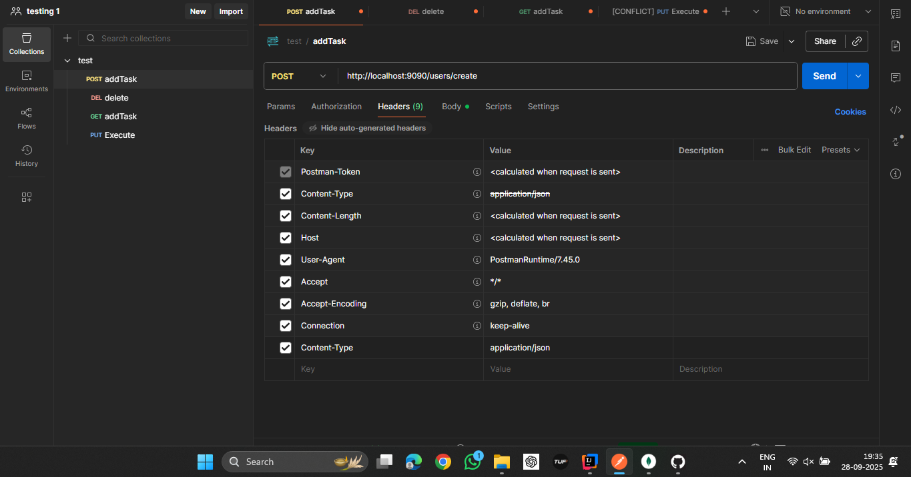
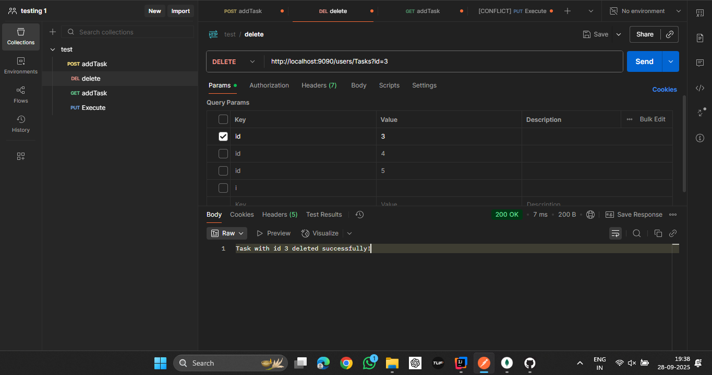
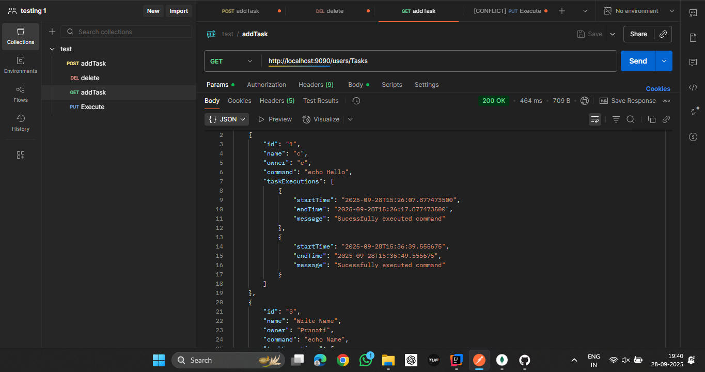
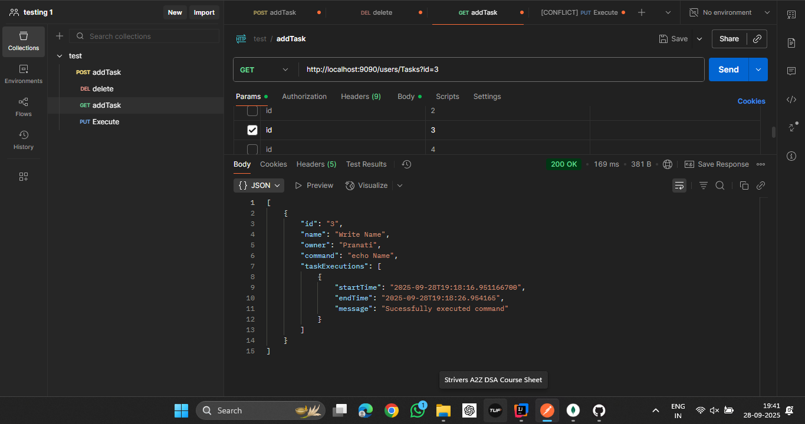
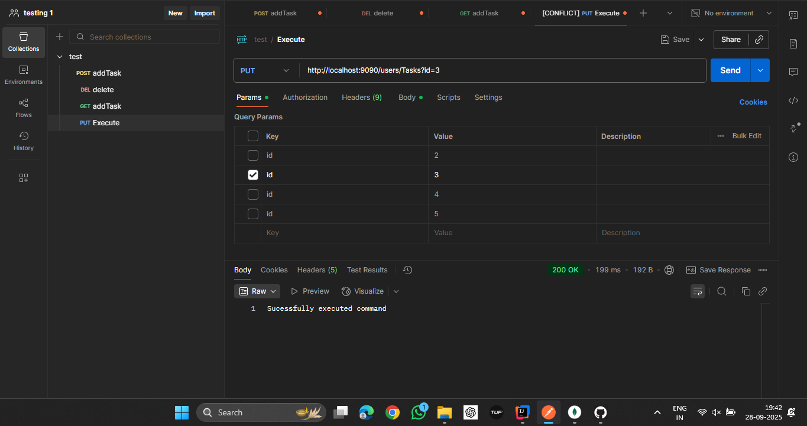

## ⚙️ Setup & Run

### 1. Prerequisites
- Java 17+
- Maven 3+
- MongoDB running locally (`localhost:27017`)
- Create a Database Named **Commands** and Collection **Tasks**
- 

### 2. Clone and Build
```sh
git clone https://github.com/koushikreddybachu/KAIBURR.git
cd KAIBURR
mvn clean install 
```

### 3. Run
```sh
mvn spring-boot:run
```

>**Note :** The Application is running in **localhost:9090**. You can change port number in src/main/resources/application.properties.
```sh
server.port = 8080
```
# API EndPoints

## Creating Task
POST - **http://localhost:9090/users/create** 


>### Set Header : **Content-type = "application/json"**
>

>### Request Body: raw/JSON
>

>### Response : Success/Fail message

## Delete Task

DELETE - http://localhost:9090/users/Tasks?id=2

>### Request
> 
> ### Response : Success/Fail message

## Get Tasks

1. GET - http://localhost:9090/users/Tasks (No parameter)
2. GET - http://localhost:9090/users/Tasks?id=1 (with id as parameter)

>### Request Without Parameter
> 
>### Response : All Tasks in DB

>### Request With Parameter
> 
>### Response : Task With id passed

## Execute Command

PUT - http://localhost:9090/users/Tasks?id=3

>### Request(Pass id as parameter)
> 
>### Response : Success/Fail Message


